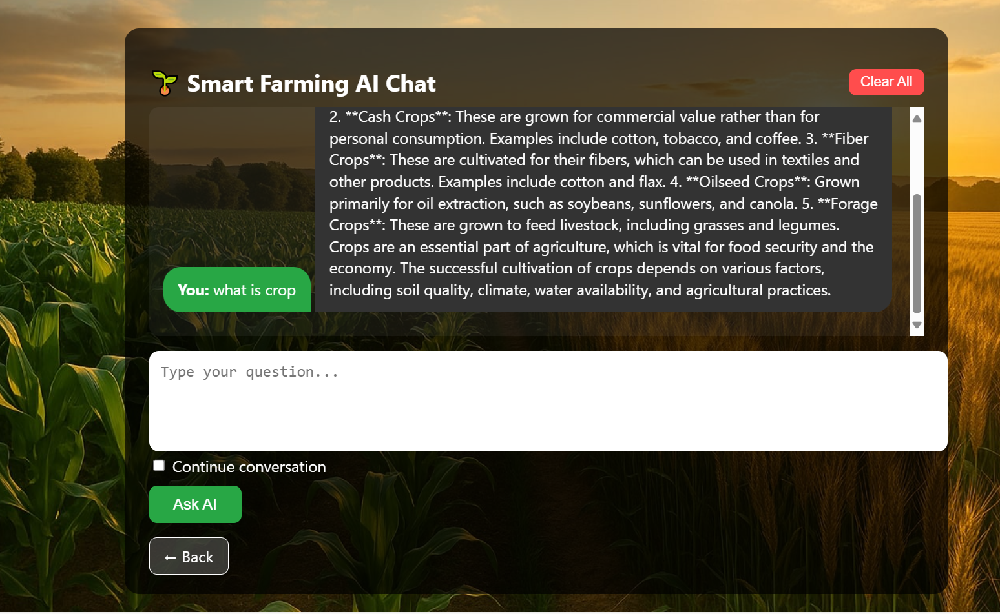
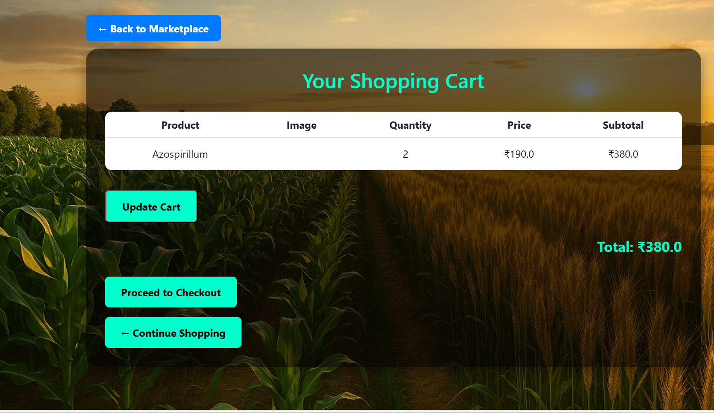
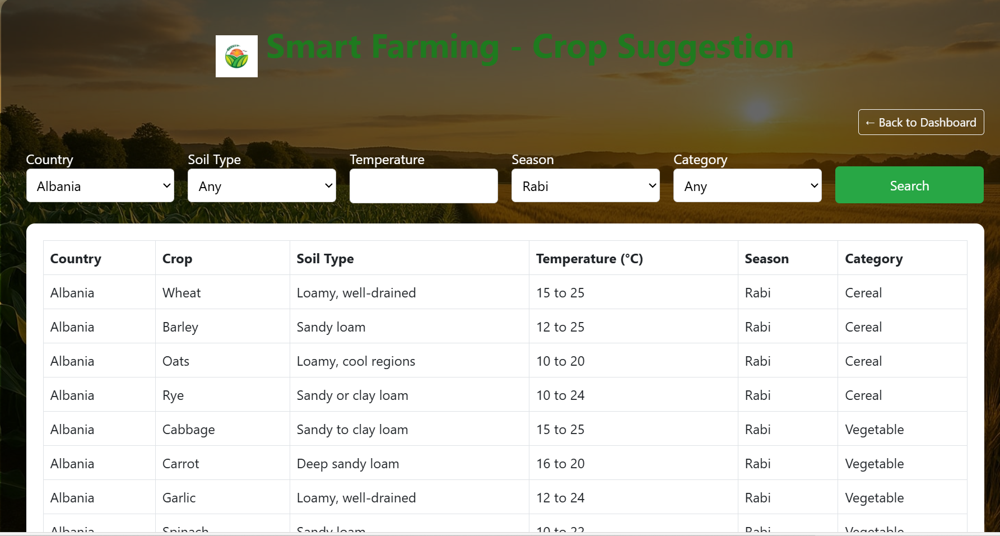
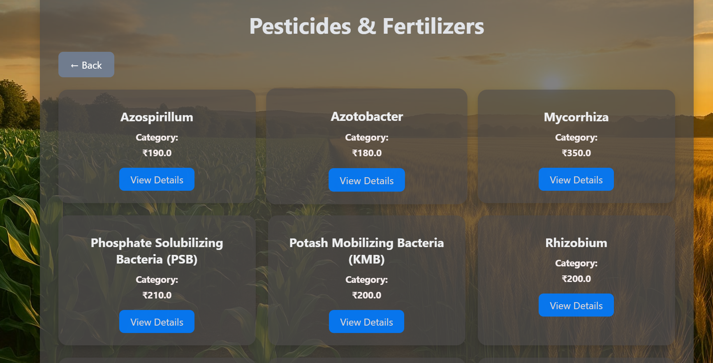
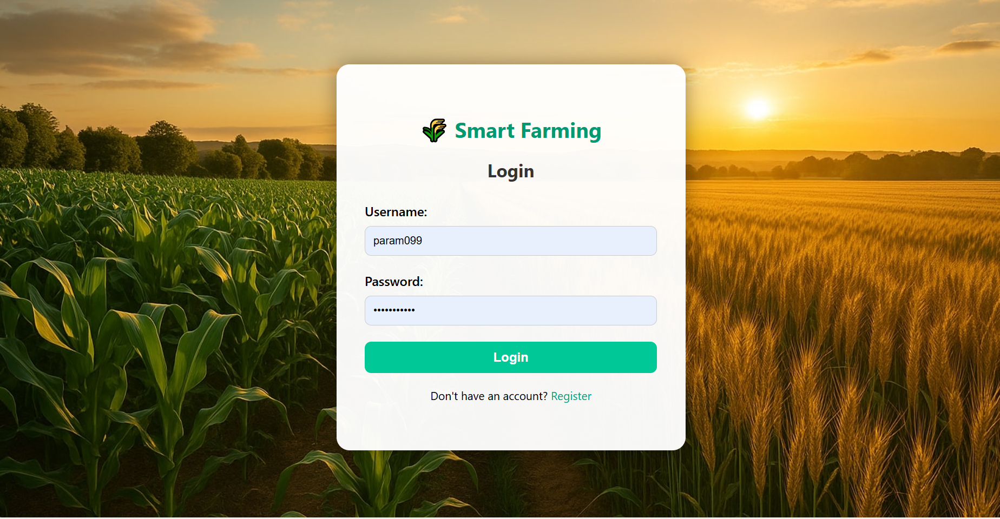
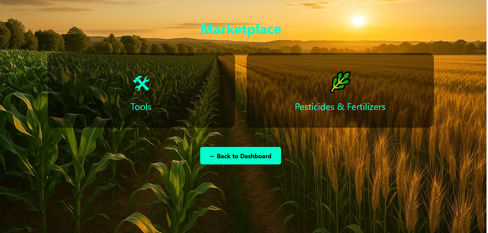
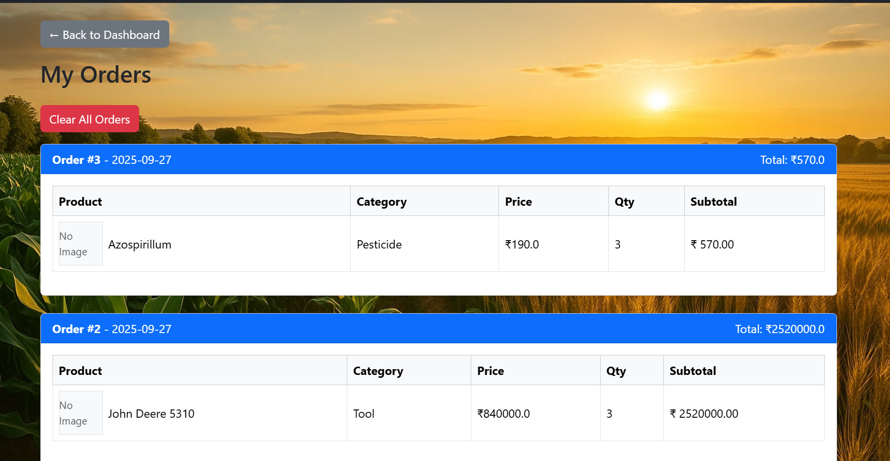
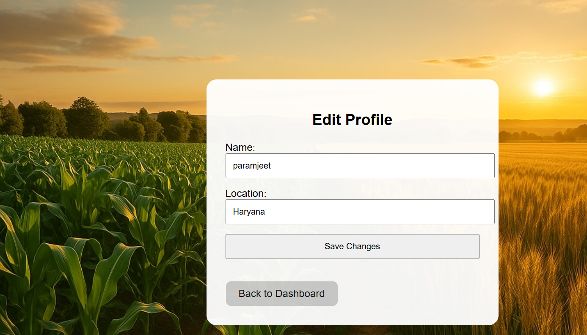
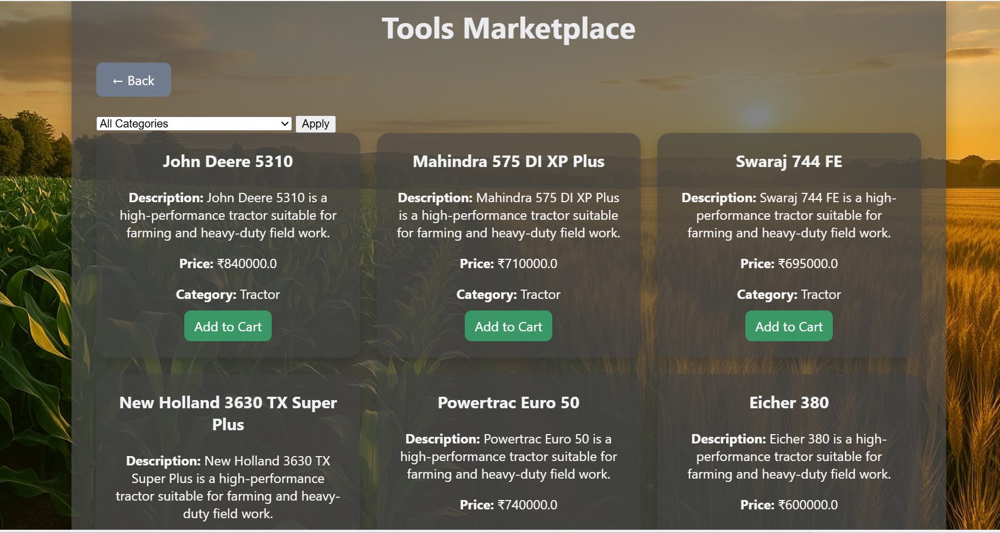
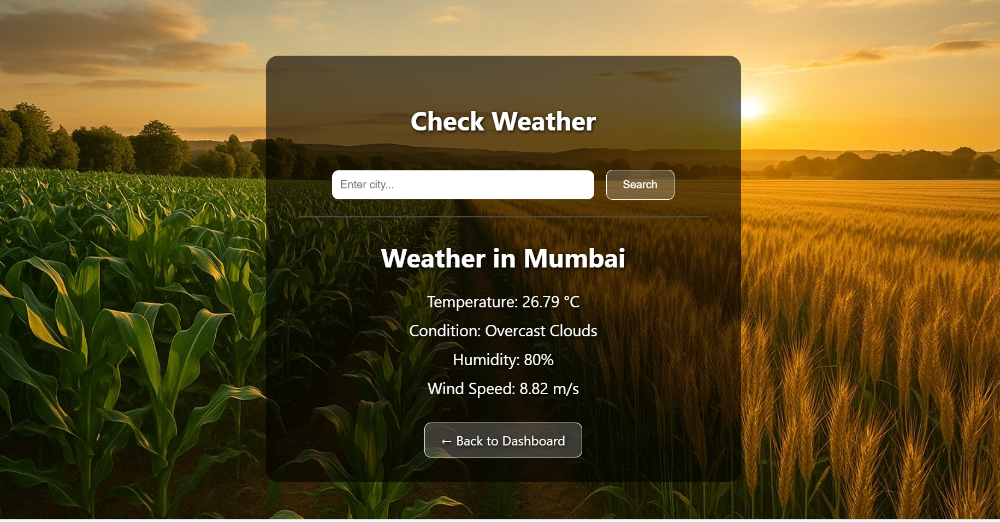

# SmartFarming 🌱


SmartFarming is a smart agriculture project that helps farmers make informed decisions using data analysis, automation tools, and crop advisory recommendations.

---

## Table of Contents
- [About](#about)
- [Features](#features)
- [Setup](#setup)
- [Usage](#usage)
- [Screenshots](#screenshots)
- [Technologies Used](#technologies-used)
- [Contributing](#contributing)
- [License](#license)

---

## About
SmartFarming assists farmers in monitoring crops, managing resources, and optimizing yield by integrating smart advisory tools and data-driven insights. This project is designed to be **user-friendly** and **scalable**, supporting future features like weather forecasting and AI recommendations.

---

## Features
- Crop monitoring and tracking  
- Resource and tool management  
- Smart advisory for better farming decisions  
- User-friendly dashboard  
- Integration with external data sources (weather, soil, etc.)  

---

## Setup

1. Clone the repo.
2. Create a `.env` file in the project root:

## Usage
To run the project locally:

1. Clone the repository:
   ```bash
   git clone https://github.com/ParamjeetSangwan/smartfarming.git

2. Navigate to the project folder:
   cd smartfarming

3. (Optional) Create and activate a virtual environment:
   python -m venv venv
   source venv/bin/activate   # Linux/Mac
   venv\Scripts\activate      # Windows

4. Install the required packages:
   pip install -r requirements.txt

5. Apply migrations:
   python manage.py migrate

6. Run the development server:
   python manage.py runserver

7. Open your browser and go to http://127.0.0.1:8000/ to access the dashboard.

---

## Screenshots













---

## Technologies Used
- Python 3.x
- Django 4.2
- HTML / CSS / JavaScript
- SQLite (or your preferred database)
- Pandas / NumPy (for data analysis)
- Bootstrap (optional for UI styling)

---

## Contributing
Contributions are welcome!

1. Fork the repository.
2. Create a new branch (`git checkout -b feature-name`).
3. Make your changes and commit (`git commit -m 'Add feature'`).
4. Push to the branch (`git push origin feature-name`).
5. Open a Pull Request.

---

## License
This project is licensed under the **MIT License**.
---

This version fixes:  
- Fully GitHub-friendly **anchors**  
- **Detailed local setup instructions**  
- **Numbered features list** for clarity  
- Notes about screenshots and database  
- Consistent formatting  
